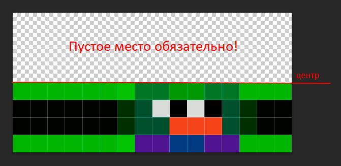

# Инструкция по созданию своей повязки
Все повязки должны иметь ширину в 16 пикселей и высоту от 1 до 12 пикселей.  
**Изображение с повязкой содердит в себе оба слоя, расположенные друг под другом, где сверху второй слой, а снизу - первый.  
Высота повязки рассчитывается как результат целочисленного деления высоты исходного изображения на 2.** Соответственно, высота исходного изображения должна быть в 2 раза больше высоты повязки. Первый слой, располагающийся под вторым, должен **обязательно** начинаться от середины исходного изображения по вертикали.

## Немного примеров
  
  
### Даже если на вашем исходном изображении нет какого-то слоя, всё равно нужно соблюдать вышеописанные правила!  

Как пример, тут повязка располагается только на первом слое:  
